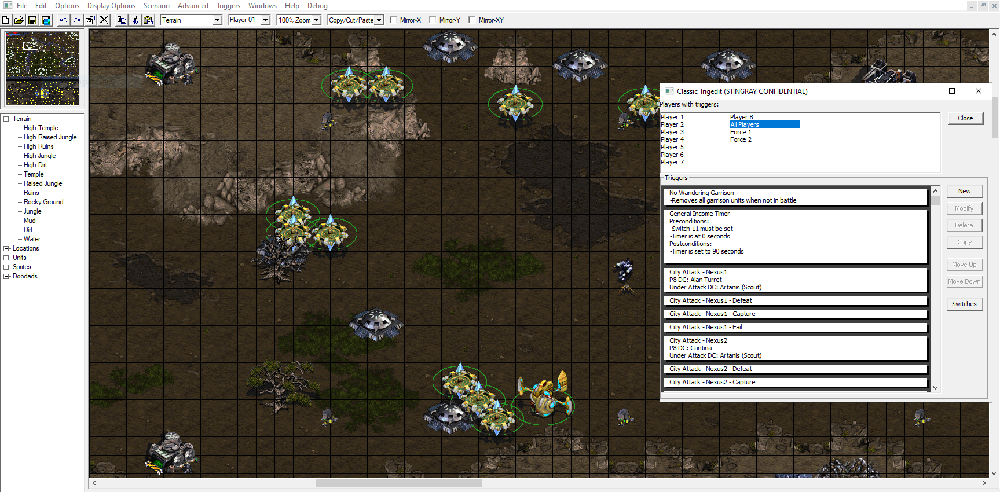
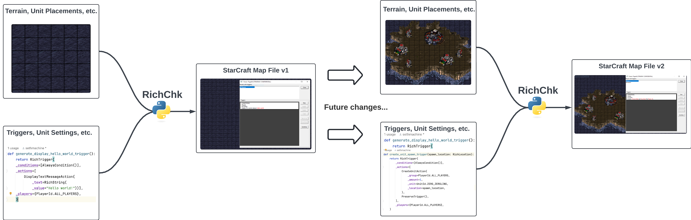
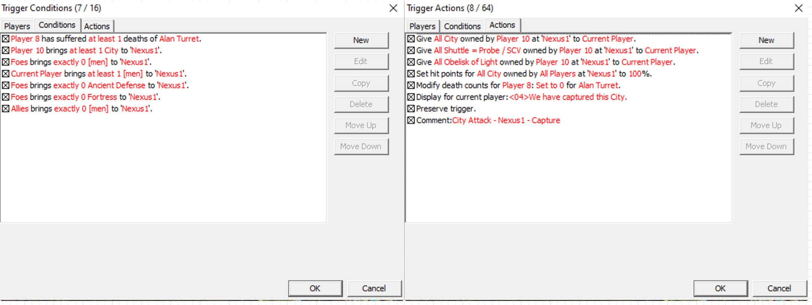
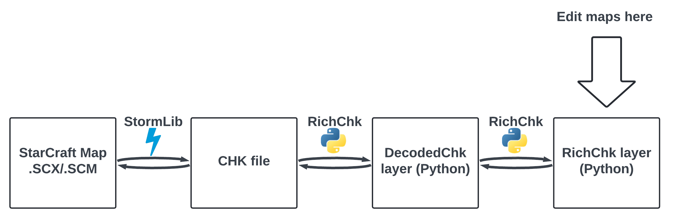

## Introduction

// **NEW** There's a lot of intro to StarCraft at the beginning here but not much about Python. I think you'd reach a broader audience if you talk more to the latter. Why Python, why it was chosen here (ie: ease of use, compatability, etc), why applying it here is great practice for using python. IT looks like you'll need some expertise with Python to use this (or maybe I'm wrong?) so pointing that out, what level of expertise, and links to learning resources could be helpful. It's not clear what this blog article is. It starts off by saying it's an intro to the finished product but it isn't just that. The bulk of it goes into details about decisions you made and what's under the hood. So something like "This is brief intro to what its is and an in depth look into the decision I made of how it works under the hood." 

In this article I will introduce [RichChk](https://github.com/sethmachine/richchk)--a library that allows directly editing StarCraft maps in Python.  Maps, or custom games, can be thought of as mods built on top of the StarCraft engine that completely change the gameplay.  While this article is mostly related to StarCraft, I'll also cover coding best practices such as immutability, functional programming, static typing, unit tests, linters, and GitHub Actions/Workflows, etc. as I've applied them to create a maintainable codebase.  I will first give a brief history of [StarCraft and custom games](#StarCraft).  After that I will dive into RichChk: [what it is](#What-is-RichChk), [why I made it](#Why-RichChk), and [how it works](#How-RichChk-works).  I will then cover how I've applied [coding best practices](#Coding-best-practices) and why these are invaluable to any project.  At the very end, I will provide a [brief survey of other comparable tools](#existing-tools) that mapmakers can use.  

If you're interested in diving straight into the library and how to use it, see the GitHub repo below which includes several "Hello World!" examples.  

* GitHub repo: https://github.com/sethmachine/richchk

## StarCraft

### History
[StarCraft](https://us.shop.battle.net/en-us/product/starcraft) was first released by Blizzard Entertainment in 1998 as a science fiction [real-time strategy (RTS)](https://en.wikipedia.org/wiki/Real-time_strategy) game where players contend for the fate of the galaxy controlling 3 different races: Terran, Zerg, and Protoss.  


Two key factors that propelled StarCraft to massive popularity include: (1) free online multiplayer with [Blizzard's Battle.net](https://en.wikipedia.org/wiki/Battle.net) and (2) 1st party support for creating mods using [StarEdit](https://us.forums.blizzard.com/en/starcraft/t/public-staredit-download/457) which allows for infinite replayability.  A typical smattering of lobbies of online multiplayer custom games is shown below:   


The community eventually developed a more powerful map editor called [ScmDraft 2](http://www.stormcoast-fortress.net/cntt/software/scmdraft), which [Blizzard officially endorsed in June 2019](https://us.forums.blizzard.com/en/starcraft/t/staredit-deprecation-in-patch-1-23-0/223).  During the early 2000s, a massive online community grew dedicated exclusively playing these custom maps, which were often implementations of other video games ([Elder Scrolls Oblivion RPG](http://sc.nibbits.com/maps/project/78115/oblivion-rpg-2013)) or universes (e.g. Lord of the Rings battles like Helms Deep).  Even [MOBA](https://en.wikipedia.org/wiki/Multiplayer_online_battle_arena) games like [Dota 2](https://www.dota2.com/) and [League of Legends](https://www.leagueoflegends.com/en-us/) can trace their ancestry to the original StarCraft custom map, [Aeon of Strife](https://starcraft.fandom.com/wiki/Aeon_of_Strife_(map)).  Fast forward to 2024, and while the custom games community is much smaller, there is still a large active group on various forums, such as [staredit.net](http://www.staredit.net/) and new custom games are being regularly produced and updated.  

### Map files

Each unique StarCraft custom game is contained entirely within a map file.  These map files are stored in an [MPQ archive file](https://encyclopedia.pub/entry/37738) with either a .SCM or .SCX file extension.  Contained within the MPQ archive, is the [CHK file](https://www.starcraftai.com/wiki/CHK_Format), which is a compact binary format containing all the data needed to play the custom game.  

Without 3rd party tools, the binary map file is not human-readable and can only be opened with StarEdit or ScmDraft.  The map file contains everything: the terrain, unit/structure placements, locations data, etc., but also the business logic of the map which is expressed via Triggers.  Triggers are a high level scripting language that controls the StarCraft engine.  From the point of view of modern webapp development, StarCraft maps can be thought of as combining the frontend (how the map looks) and backend (how the map plays) into a single file.  This is ideal for peer to peer transmission and downloading of maps, especially when bandwidth was quite limited in the early days of online gaming.  However, this is not ideal from the perspective of creating and maintaining a custom game, as it becomes hard to decouple the visuals from the business logic.

RichChk solves the problem of separating a custom game's visuals from its business logic.  RichChk accomplishes this by allowing mapmakers to edit all aspects of a StarCraft map in Python without ever opening a GUI map editor.  This allows for using traditional software engineering practices like version control, and decouples the map's visuals from its business logic.

## What is RichChk?

RichChk is a Python library that allows editing StarCraft's CHK files, and hence the ability to modify StarCraft map files in Python without ever needing to open a GUI program.  RichChk provides a semantically **rich** and human-readable model of the **CHK** format.  The traditional creation of StarCraft maps is done in a visual GUI program like StarEdit or ScmDraft.  GUI editors are ideal for visual aspects such as the terrain or unit placements.  However, the business logic of a map is done through Triggers.  This is where the map editors fall short: there is no way to organize or re-use Triggers as one might do for a modern codebase.  



The above image depicts [ScmDraft 2](http://www.stormcoast-fortress.net/cntt/software/scmdraft), a GUI based program to visually create and edit StarCraft custom games.  

RichChk offers the same exact functionality as any GUI map editor, but with the advantage of being able to modify the map purely in Python.  This allows map development to be completed in modern IDEs like [PyCharm](https://www.jetbrains.com/pycharm/).  

## Why RichChk?

RichChk decouples the visuals of a map (terrain, unit placements, etc.) from its business logic (expressed via Triggers).  This can provide mapmakers both a massive ergonomic boost and developer experience improvement. One of the difficulties of making complex games in StarCraft is working with the [Triggers engine](http://classic.battle.net/scc/faq/triggers.shtml), which arguably is the most important aspect of a custom game, as it contains all the business logic for the modifying the game behavior.  For any non-trivial map, creating, maintaining, and updating these systems quickly becomes unwieldy.  The diagram below illustrates how the RichChk helps separate the visuals of a map from its business logic/Triggers: 



Now consider the following trigger as shown in the ScmDraft editor:



A trigger consists of conditions and actions.  On the left are the conditions, which are the boolean statements that all must be satisfied for the trigger to execute.  On the right are the actions, which is what will happen if the conditions are true.  This single trigger is just one part of a much larger trigger system for "Garrisons" in this custom map.  The complete functional requirements for the Garrisons system are:

* Player controlled units emerge from a structure when enemies attack it
* Player controlled units return to the structure when there are no more enemies nearby
* If a player defeats all foes defending an enemy controlled structure, the player is given control of it

This particular trigger handles the capturing of an enemy's "garrison".  Conditions and actions must be added one by one in the GUI from a dropdown menu.  While each trigger can be copied to help reduce boilerplate, there is no way to reference other triggers, variables, data structures, or external data to configure them.  For the Garrison system like this, there can be an upward of 4 triggers per player to model each state per structure on the map, which is roughly 32 triggers per player.  At this scale, it becomes a mind-numbing task to manually copy each trigger and replace the data so it works for each player.  This is also prone to human error in manually copying the data.  Imagine if there is a mistake or a future enhancement needs to happen!  Completing simple, repetitive tasks prone to human error are what modern programming best practices solve.   

Now consider building the Garrisons system using RichChk:

```python garrison_triggers.py
def generate_garrison_captured_for_player(
    garrison: Garrison, player: PlayerId, dc_timer: AllocatedDeathCounter
) -> RichTrigger:
    return RichTrigger(
        _conditions=[
            DeathsCondition(
                _group=dc_timer.player,
                _comparator=NumericComparator.EXACTLY,
                _amount=1,
                _unit=dc_timer.unit,
            ),
            BringCondition(
                _group=PlayerId.FOES,
                _comparator=NumericComparator.AT_LEAST,
                _amount=1,
                _unit=garrison.structure,
                _location=garrison.location,
            ),
            BringCondition(
                _group=player,
                _comparator=NumericComparator.AT_LEAST,
                _amount=1,
                _unit=UnitId.MEN,
                _location=garrison.location,
            ),
        ]
        + generate_condition_for_undefended_garrison_by_foes(garrison),
        _actions=[
            SetDeathsAction(
                _group=dc_timer.player,
                _unit=dc_timer.unit,
                _amount=0,
                _amount_modifier=AmountModifier.SET_TO,
            ),
            GiveUnitAction(
                _from_group=PlayerId.FOES,
                _to_group=player,
                _amount=1,
                _unit=garrison.structure,
                _location=garrison.location,
            ),
            ModifyUnitHitpointsAction(
                _group=player,
                _unit=garrison.structure,
                _amount=1,
                _percent=100,
                _location=garrison.location,
            ),
            DisplayTextMessageAction(
                _text=RichString(_value=_GARRISON_CAPTURED_MESSAGE)
            ),
            MinimapPingAction(_location=garrison.location),
            PreserveTrigger(),
        ],
        _players={player},
    )
```

This is the same trigger as earlier but coded in Python.  The Python function is parameterized for each player via the `player` argument and supports different types of garrisons via the `Garrison` custom data structure.  The `dc_timer` is a variable that tracks the state of the Garrisons system.  With a simple for loop over players and garrisons, this can instantly generate all the triggers needed for allowing a player to capture an enemy's garrison structure.  If any modifications are needed, one simply edits this method and uses RichChk to create the new map.  E.g. it would be trivial in the future to update this script to also play a particular sound file whenever a garrison is captured (via the `PlayWavAction`).  Doing so without RichChk would require manually editing hundreds of triggers!  

 
## How RichChk works



[//]: # (Clarfiy that this is how it works under the hood. Additionally it would be good to organize each paragraph [or perhaps even clearly label it] Problem and Solution. OR at least some sort of goal you're achieve with the chunk of functionatliy you then explain. It dives straight into the explanation but I feel like I'm missing your bigger picture a bit which makes me feel like I'm just swimming in the details a bit lost)

In this section I describe the technical details of how RichChk works under the hood.  The technical details illustrate the concepts of immutability, protocols, functional programming, and static typing, and how these are applied to create a powerful but human friendly developer experience to edit and create custom maps.  For how to use RichChk for map development, please see the [readme](https://github.com/sethmachine/richchk?tab=readme-ov-file#usage).  

RichChk implements the CHK format as fully detailed in [staredit.net's Scenario.chk wiki](http://www.staredit.net/wiki/index.php/Scenario.chk).  The CHK is extracted from a StarCraft MPQ file (.SCM or .SCX file extension) using [StormLib](http://www.zezula.net/en/mpq/stormlib.html), an open source C++ library for reading and writing MPQ archive files.  The task of parsing the binary format and the task of editing the CHK data divided into separate classes and models within RichChk.  This is because much of the CHK data references other CHK sections using IDs and array indices, so providing an editable layer hiding these details makes it much easier for a human to create and edit map data.  

### Reading CHK data
The CHK file is structured in a series of sections that follow one after the other.  Each section always has an 8-byte header with 4 bytes for its name and another 4 bytes for how long the section is in bytes.  This information allows tokenizing the CHK file into each section, and then parsing each section based on its specific format (each section has its own unique binary encoding). The CHK file is then decoded, section by section, into Python dataclass equivalents via the [ChkIo#decode_chk_file](https://github.com/sethmachine/richchk/blob/master/src/richchk/io/chk/chk_io.py#L56C9-L56C24), which get stored as a list in a [DecodedChk](https://github.com/sethmachine/richchk/blob/master/src/richchk/model/chk/decoded_chk.py#L12) object.  The actual decoding is a while loop operation that iterates over the bytes of the CHK file until no more sections are found, as shown in [ChkIo#_decode_chk_byte_stream](https://github.com/sethmachine/richchk/blob/master/src/richchk/io/chk/chk_io.py#L94).  There is a transcoder for each known CHK section which implements the [DecodedChkSectionTranscoder](https://github.com/sethmachine/richchk/blob/master/src/richchk/transcoder/chk/chk_section_transcoder.py#L15) protocol.  Each transcoder knows how to **decode** bytes into its section (read into Python objects), and how to **encode** back into the bytes representation (write back to CHK binary file).  For example, below is the `ChkMrgnTranscoder`, which knows how go back and forth between bytes and the corresponding Python class `DecodedMrgnSection`.  The [MRGN](http://www.staredit.net/wiki/index.php/Scenario.chk#.22MRGN.22_-_Locations) represents all locations defined in a map (used to target specific regions of the map for triggering).  


```python chk_mrgn_transcoder.py
import struct
from io import BytesIO

from ....model.chk.mrgn.decoded_location import DecodedLocation
from ....model.chk.mrgn.decoded_mrgn_section import DecodedMrgnSection
from ....transcoder.chk.chk_section_transcoder import ChkSectionTranscoder
from ....transcoder.chk.chk_section_transcoder_factory import _RegistrableTranscoder


class ChkMrgnTranscoder(
    ChkSectionTranscoder[DecodedMrgnSection],
    _RegistrableTranscoder,
    chk_section_name=DecodedMrgnSection.section_name(),
):
    def decode(self, chk_section_binary_data: bytes) -> DecodedMrgnSection:
        bytes_stream: BytesIO = BytesIO(chk_section_binary_data)
        locations: list[DecodedLocation] = []
        index = 0
        while bytes_stream.tell() != len(chk_section_binary_data):
            left_x1 = struct.unpack("I", bytes_stream.read(4))[0]
            top_y1 = struct.unpack("I", bytes_stream.read(4))[0]
            right_x2 = struct.unpack("I", bytes_stream.read(4))[0]
            bottom_y2 = struct.unpack("I", bytes_stream.read(4))[0]
            string_id = struct.unpack("H", bytes_stream.read(2))[0]
            elevation_flags = struct.unpack("H", bytes_stream.read(2))[0]
            locations.append(
                DecodedLocation(
                    _left_x1=left_x1,
                    _top_y1=top_y1,
                    _right_x2=right_x2,
                    _bottom_y2=bottom_y2,
                    _string_id=string_id,
                    _elevation_flags=elevation_flags,
                )
            )
            index += 1
        return DecodedMrgnSection(_locations=locations)

    def _encode(self, decoded_chk_section: DecodedMrgnSection) -> bytes:
        data: bytes = b""
        for location in decoded_chk_section.locations:
            data += struct.pack("I", location.left_x1)
            data += struct.pack("I", location.top_y1)
            data += struct.pack("I", location.right_x2)
            data += struct.pack("I", location.bottom_y2)
            data += struct.pack("H", location.string_id)
            data += struct.pack("H", location.elevation_flags)
        return data
```

Each section is modeled in a corresponding dataclass.  These can be found in [richchk.model.chk](https://github.com/sethmachine/richchk/tree/master/src/richchk/model/chk).  Not all sections need to be modeled or parsed for the decoding to work.  If a section is not currently modeled, then its unparsed bytes are wrapped by a special [DecodedUnknownSection](https://github.com/sethmachine/richchk/blob/master/src/richchk/model/chk/unknown/decoded_unknown_section.py) handler.  These sections can be safely ignored while still being able to read and edit the parsed sections.   For my use case, I chose to initially only model all the sections needed to edit Triggers.  

The `DecodedChk` is still just a wrapper around the binary CHK format in Python objects, and is not meant to be editable.  Thus a higher level of abstraction is needed to facilitate editing CHK data.  This is where the [RichChk](https://github.com/sethmachine/richchk/blob/master/src/richchk/model/richchk/rich_chk.py#L24) class is introduced.  Just as the `DecodedChk` contains all the binary CHK sections of a map file, the `RichChk` contains all the corresponding rich CHK sections, or more specifically a list of [RichChkSection](https://github.com/sethmachine/richchk/blob/master/src/richchk/model/richchk/rich_chk_section.py).  Compare the trigger models in [richchk.model.richchk.trig](https://github.com/sethmachine/richchk/tree/master/src/richchk/model/richchk/trig) to the lower level models in [richchk.model.chk.trig](https://github.com/sethmachine/richchk/tree/master/src/richchk/model/chk/trig).  The former has a plentiful taxonomy of classes and enums modeling how a human would understand and create triggers, while the latter is just a wrapper around the compact binary format triggers are stored in.


### Writing CHK data

Writing CHK data is more difficult than reading it, because each CHK section may reference data found in other CHK sections as IDs, array indices, or even byte offsets!  For example, all string data (the name of units, locations, messages displayed to players, etc.) is stored in the [STR section](http://www.staredit.net/wiki/index.php/Scenario.chk#.22STR_.22_-_String_Data) as sequences of characters.  For a section like [UNIS](http://www.staredit.net/wiki/index.php/Scenario.chk#.22UNIS.22_-_Unit_Settings) that is used to rename a unit, the new unit name itself must be a reference to an existing string in the STR by its array index.  Thus introducing a new unit name requires editing two different sections, the STR and the UNIS.  This would be quite cumbersome for a human to manually update the STR section, track its position, and then use that index as a reference in the actual unit name.  Even more difficult would be to delete referenced data or update/insert in place, as these operations could potentially require shifting every other sections' data.

Just as the [ChkIo](https://github.com/sethmachine/richchk/blob/master/src/richchk/io/chk/chk_io.py) iterates over each binary CHK section and parses it into its corresponding `DecodedChkSection` to output a `DecodedChk` object, the [RichCkIo](https://github.com/sethmachine/richchk/blob/master/src/richchk/io/chk/chk_io.py) class does the same, except it operates on a `DecodedChk` object.  It processes each `DecodedChkSection` and parses it into its corresponding [RichChkSection](https://github.com/sethmachine/richchk/blob/master/src/richchk/model/richchk/rich_chk_section.py).  Each `RichChkSection` has its own specialized [RichChkSectionTranscoder](https://github.com/sethmachine/richchk/blob/master/src/richchk/transcoder/richchk/richchk_section_transcoder.py), which knows to decode a `DecodedChkSection` and how to encode back into that representation.  E.g. the [RichChkMrgnTranscoder](https://github.com/sethmachine/richchk/blob/master/src/richchk/transcoder/richchk/transcoders/richchk_mrgn_transcoder.py) is used for reading location data into an editable and human-readable representation.  

The RichChkIo outputs a [RichChk](https://github.com/sethmachine/richchk/blob/master/src/richchk/model/richchk/rich_chk.py) object.  This class has a list containing a mix of both `RichChkSection` and `DecodedChkSection` objects.  In general, for sections that are not known or which do not have a useful editable representation (e.g. the STR section), these are left as `DecodedChkSection` objects.  

To now edit CHK data, it is necessary to use specialized editor classes for each section that is being updated.  For example, to add new triggers (represented in [RichTrigSection](https://github.com/sethmachine/richchk/blob/master/src/richchk/model/richchk/trig/rich_trig_section.py), one would use the [RichTrigEditor](https://github.com/sethmachine/richchk/blob/master/src/richchk/editor/richchk/rich_trig_editor.py).  This editor knows how to add new triggers, and outputs a brand new  `RichTrigSection` (importantly, **it does not modify its input!**).  With the updated TRIG section, a new CHK can be produced by replacing the old TRIG section with the new one using [RichChkEditor](https://github.com/sethmachine/richchk/blob/master/src/richchk/editor/richchk/rich_chk_editor.py), which outputs an entirely new CHK (again, not modifying any of its inputs).  

Finally, when encoding the rich representation back to its binary CHK format, contextual data is gathered across all CHK sections.  This includes string data, location data, and any other data that is represented as references and not inlined in the CHK format.  This context is represented as the [RichChkEncodeContext](https://github.com/sethmachine/richchk/blob/master/src/richchk/model/richchk/richchk_encode_context.py), which all transcoders have access to.  This allows turning raw strings into IDs to back into the binary CHK format.  There is also a mirrored context when going from `DecodedChk` to `RichChk` called the [RichChkDecodeContext](https://github.com/sethmachine/richchk/blob/master/src/richchk/model/richchk/richchk_decode_context.py).  

The actual writing back to a playable map file is done through the [StarCraftMpqIo](https://github.com/sethmachine/richchk/blob/master/src/richchk/io/mpq/starcraft_mpq_io.py) class, which uses StormLib under the hood to replace the underlying CHK file with the newly updated CHK.  
 
### Hello World

Putting everything together, below is the quintessential "Hello world!" example.  This script displays "Hello world!" to all the players in the game.

```python hello_world.py
from richchk.editor.richchk.rich_chk_editor import RichChkEditor
from richchk.editor.richchk.rich_trig_editor import RichTrigEditor
from richchk.io.mpq.starcraft_mpq_io_helper import StarCraftMpqIoHelper
from richchk.io.richchk.query.chk_query_util import ChkQueryUtil
from richchk.model.richchk.str.rich_string import RichString
from richchk.model.richchk.trig.actions.display_text_message_action import (
    DisplayTextMessageAction,
)
from richchk.model.richchk.trig.conditions.always_condition import AlwaysCondition
from richchk.model.richchk.trig.player_id import PlayerId
from richchk.model.richchk.trig.rich_trig_section import RichTrigSection
from richchk.model.richchk.trig.rich_trigger import RichTrigger

INPUT_MAP_FILE = "maps/base-map.scx"
OUTPUT_MAP_FILE = "generated-maps/hello-world-generated.scx"


def generate_display_hello_world_trigger() -> RichTrigger:
    return RichTrigger(
        _conditions=[AlwaysCondition()],
        _actions=[DisplayTextMessageAction(_text=RichString(_value="Hello world!"))],
        _players={PlayerId.ALL_PLAYERS},
    )


if __name__ == "__main__":
    mpqio = StarCraftMpqIoHelper.create_mpq_io()
    chk = mpqio.read_chk_from_mpq(INPUT_MAP_FILE)
    new_trig = RichTrigEditor().add_triggers(
        [generate_display_hello_world_trigger()],
        ChkQueryUtil.find_only_rich_section_in_chk(RichTrigSection, chk),
    )
    new_chk = RichChkEditor().replace_chk_section(new_trig, chk)
    mpqio.save_chk_to_mpq(
        new_chk, INPUT_MAP_FILE, OUTPUT_MAP_FILE
    )
```

## Coding best practices

In this section I describe how RichChk uses various coding best practices like unit tests, static typing, linters, pre-commit checks, etc.  The ultimate purpose of these best practices is to make feature development as frictionless as possible while also guarding against regressions when new changes are made.  This is so developers spend their time on the hardest parts of coding, and not waste time on coding style or failing unit tests.  

### Unit tests

RichChk has [a large suite of 200+ unit tests](https://github.com/sethmachine/richchk/tree/master/test) that provide test coverage on nearly every behavior.  I use the [pytest](https://docs.pytest.org/en/stable/) unit test framework, due its wide documentation and ease of using fixtures.  The unit tests both prove that a feature is working and guard against future regressions.  This is critical because the reading and writing of CHK data has many interdependencies--if one CHK section is handled incorrectly, this can cause a dependent section to be misinterpreted.  In addition, the CHK format is not open source and there is no official implementation to follow.  Tests can be used to catch edge cases and ensure the correct implementation of the actual format.  For example, as I've added support for additional CHK sections, these broke the existing tests which have provided me a valuable signal to go back and fix the underlying implementation.  

Finally, in most cases my tests are not true unit tests, as there is almost no mocking done.  This makes writing the tests much simpler and avoids many of [the pitfalls of excessive unit test mocking](https://news.ycombinator.com/item?id=27884355).

### Linters

I use a variety of stylistic linters to make sure the code style is consistent and uniform.  This means discussions on new features and PRs are not spent on debating stylistic choices, but the actual functionality.  The linters include:

* [isort](https://pycqa.github.io/isort/): consistent sort order of all Python imports.
* [docformatter](https://pypi.org/project/docformatter/): consistent formatting of docstrings.
* [flake8](https://flake8.pycqa.org/en/latest/): enforces [PEP-8](https://peps.python.org/pep-0008/) Python conventions
* [black](https://github.com/psf/black): automatically reformats Python code to meet conventions where possible (i.e. flake8/PEP-8 rules)

For local development, I use [File Watchers](https://www.jetbrains.com/help/idea/using-file-watchers.html) that run whenever code is saved, and automatically apply all the linting.  See [richchk-file-watchers.xml](https://github.com/sethmachine/richchk/blob/master/pycharm/richchk-file-watchers.xml ) for how I set these up in the PyCharm IDE.  

### Static typing

RichChk is a statically typed Python codebase using [mypy](https://mypy-lang.org/).  While typing code in Python is optional, e.g. `my_string: str`, it vastly improves readability, understanding how to use an existing library, and prevents bugs due to type enforcement, among many other advantages.  Static typing also is a form of documentation of the code itself, which is important when providing a library that others may use. See this mypy article for discussions on static typing: [Would my project benefit from static typing?](https://mypy.readthedocs.io/en/latest/faq.html#would-my-project-benefit-from-static-typing) and why it's often a good choice.  

I run mypy locally as a file watcher, so as I write code, I get warnings or hints about the static typing to make sure everything is being typed and annotated.

### Protocols

Related to static typing, [protocols](https://mypy.readthedocs.io/en/stable/protocols.html) can be used to define abstract interfaces and contracts that concrete classes must implement when combined with [abstract base classes](https://docs.python.org/3/library/abc.html).  This reduces boilerplate and repeated code, and provides an established pattern for adding new functionality.  I use this for the various CHK section transcoders--while each CHK section has its own unique binary format, the external behavior is the same for each CHK section.  Consider a `DecodedChkSectionTranscoder` which must do the following operations:

* **decode**: Input bytes and output a specific `DecodedChkSection`
* **encode**: Input `DecodedChkSection` and output its representation as bytes

The internals of the decode and encode operations may be different between a `DecodedStrSection` (string data) and a `DecodedMrgnSection` (location data), but the inputs of both methods are always the same (encode is typed to the section).  `ChkSectionTranscoder` uses a protocol to describe this interface:

```python
_T = TypeVar("_T", bound=DecodedChkSection, contravariant=True)
@runtime_checkable
class ChkSectionTranscoder(Protocol[_T]):
    def __call__(self, *args: list[Any], **kwargs: dict[str, Any]) -> Any:
        return self

    @abstractmethod
    def decode(self, chk_section_binary_data: bytes) -> DecodedChkSection:
        raise NotImplementedError

    def encode(self, decoded_chk_section: _T, include_header: bool = True) -> bytes:
        chk_binary_data = self._encode(decoded_chk_section)
        if include_header:
            return (
                self.encode_chk_section_header(
                    decoded_chk_section.section_name(), len(chk_binary_data)
                )
                + chk_binary_data
            )
        return chk_binary_data

    @abstractmethod
    def _encode(self, decoded_chk_section: _T) -> bytes:
        raise NotImplementedError

    @classmethod
    def encode_chk_section_header(
        cls, chk_section_name: Union[ChkSectionName, str], chk_binary_data_size: int
    ) -> bytes:
        if isinstance(chk_section_name, ChkSectionName):
            raw_section_name: str = chk_section_name.value
        else:
            raw_section_name = chk_section_name
        data: bytes = b""
        data += struct.pack(
            "{}s".format(len(raw_section_name)),
            bytes(raw_section_name, _STRING_ENCODING),
        )
        data += struct.pack("I", chk_binary_data_size)
        return data
```

This pattern has made it easy to add support for new CHK sections as needed, as there's a clear established pattern and contract to follow.  The less ways to accomplish something, the easier it is, since the protocol will tell you exactly what to do!  Further, mypy will help enforce the protocols during its static type checking.  

### pre-commit 

Tying together all the linters and mypy static type checking, I use the [pre-commit framework](https://pre-commit.com/) which can be configured to run various checks locally before allowing local Git commits.  If any of the checks fail (e.g. static type is missing, import order is wrong, etc.), pre-commit will prevent me from committing any code that doesn't meet the stylistic or static type conventions of the codebase.  This means I can never put up a pull request that has incorrect style, missing types, etc.  This runs only locally, and doesn't prevent merges to the main branch.  See the [RichChk pre-commit.yaml](https://github.com/sethmachine/richchk/blob/master/.pre-commit-config.yaml) for all the checks used.  One of the benefits here is this also avoids running any more expensive CI/CD pipelines that could be triggered on pull requests until the code passes the quick linting, type, and formatting checks.  Note that **unit tests are not part of pre-commit**; this should instead be part of the CI/CD pipeline that verifies all tests pass before allowing merges to the main branch.  

### GitHub Actions/Workflows

To enforce linting, static typing, code conventions, and unit tests passing, it is necessary to prevent merges to the main branch unless the feature branch passes all these checks.  This can be done through [GitHub Actions/Workflows](https://docs.github.com/en/actions), which trigger workloads that run on virtual machines and can execute arbitrary code.  RichChk uses the [pull request hook](https://github.com/sethmachine/richchk/blob/master/.github/workflows/pre-commit.yaml#L3) that executes whenever a pull request is made, or the PR is updated.  I use two ordered jobs: (1) run all pre-commit checks (2) and then run the unit tests, only if the pre-commit checks pass.  These workflows ensure that the main branch always has code that is statically typed, meets stylistic and code conventions, and has all tests passing.  Pull requests cannot be merged in unless all the checks pass.  See the full [RichChk GitHub Actions pre-commit.yaml](https://github.com/sethmachine/richchk/blob/master/.github/workflows/pre-commit.yaml).  


### Cross-Platform Support

RichChk is a library that is meant to be used by anyone who wants to create StarCraft custom games.  While I prefer to develop code on macOS, much of the StarCraft player base is on Windows or Linux.  Thus, it is critical to support all 3 operating systems so the library can benefit the entire community.  Thankfully, GitHub actions makes it simple to automatically run CI/CD jobs on multiple different operating systems.  In the GitHub Actions pre-commit.yaml, there is the [matrix OS option](https://docs.github.com/en/actions/writing-workflows/choosing-what-your-workflow-does/running-variations-of-jobs-in-a-workflow), which allows re-running each job on a different operating systems!  For RichChk, each job for linting, static typing, unit tests, etc. is run 3 different times: on macOS, on Linux, and on Windows.  This means that no code can be merged in that could break compatability with the supported operating systems, and any developer must make sure their changes are compatible with all OSes, irrespective of the OS of their development machine.  

This also vastly increases the value of unit tests, as with proper coverage I can automatically ensure that RichChk works no matter if the user is on macOS, Windows, or Linux.

### Immutability

Immutability is the idea that data structures cannot be modified once they are instantiated.  There are many benefits to imposing this restriction.  Key among these are locality of reasoning: passing in arguments to a function means those arguments won't be modified after the function is applied no matter what happens inside the function.  Second, making data structures immutable will encourage using the proper ways the library provides to modify these, and related to that, write code that always returns a new data structure rather than mutate an existing one.  For more discussion on why immutability is preferable to mutability, see this article on [Risks of mutation](https://web.mit.edu/6.005/www/fa15/classes/09-immutability/#risks_of_mutation).  

For Python, it's tricky to enforce true immutability, since there is no notion of private/protected fields, and anyone savvy enough can mutate any object under the hood via functions like `__dict__` and `setattr`.  Nevertheless, there are conventions to encourage immutability.  The ways I've done this are the following:

* Use `@dataclasses.dataclass(frozen=True)` for every custom object.  [Frozen](https://docs.python.org/3/library/dataclasses.html#frozen-instances) prevents directly assigning fields in the dataclass and using `setattr`.  
* Name the fields with underscore, like `_value` instead of `value` to discourage direct access.
* Use the [@property annotation](https://docs.python.org/3/howto/descriptor.html#properties) to expose read-only public fields, e.g. calling `object.value` to access `object._value` only allows reading and does not allow re-assignment / mutation.  `object.value = 5` would cause a runtime exception.  

I use this pattern for all the dataclasses and objects in RichChk, as illustrated by the `DecodedStrSection`:

```python
@dataclasses.dataclass(frozen=True)
class DecodedStrSection(DecodedChkSection):
    _number_of_strings: int
    _string_offsets: list[int]
    _strings: list[str]

    @classmethod
    def section_name(cls) -> ChkSectionName:
        return ChkSectionName.STR

    @property
    def number_of_strings(self) -> int:
        return self._number_of_strings

    @property
    def strings_offsets(self) -> list[int]:
        return self._string_offsets

    @property
    def strings(self) -> list[str]:
        return self._strings
```

Note this is not full proof.  Any mutable field can be easily mutated once it's referenced, as in the case of the mutable `list` data structure.  Future improvements here would be to use an immutable data structure such as `tuple`.  

### Functional programming

Strongly coupled with immutability is functional programming.  Here, all functions/methods always return the same output given the same inputs no matter how many times the function is called: they are idempotent.  Functions never modify state, whether global or mutate their inputs.  This makes them [pure functions](https://en.wikipedia.org/wiki/Pure_function), and therefore much easier to reason about.  Each function is specialized to perform a single computation, output a new object, and pass it along for input to the next function.  Complex behavior is accomplished by composing many specialized functions and methods.  Finally, code is code and data is data.  In RichChk, this means all business logic is done in classes separate from the actual data structures.  A `RichChk` object does not know how to add or replace sections; this is done by the `RichChkEditor`, which knows how to replace a section and then output a brand new `RichChk` object.  

Initially this may sound quite restrictive.  However the benefits can't be understated.  Like data immutability, knowing all functions are pure allows for locality of reasoning.  Whatever happens in each function call cannot affect any state, as it will only return a brand new object and not modify its inputs.  This allows for treating most method calls like blackboxes, it does not matter what goes inside.  This also simplifies unit testing and mocking if needed.  All in all, this makes code significantly to reason about.  

While there is no way to explicitly enforce a functional programming style in Python, I've used the following conventions to approximate functional programming:

* Data structures are read-only and cannot modify or manipulate themselves.  For each data structure that needs to be modified, I have a separate editor-like class which outputs a new data structure that is the original plus change needed. 
* All methods/functions output a brand new object and do not modify any of the inputs or any global state.
* There is a specialized class or method for each operation.  For example, modifying a CHK section is tied to a particular CHK editor class, e.g. use `RichTrigEditor` to add triggers or `RichWavEditor` to add sound files.  Then to create a new CHK from the modified sections, use `RichChkEditor` to produce a brand new CHK that contains the new TRIG and new WAV sections from the previous steps.   

For more discussions on the value of functional programming, see [Advantages of Functional Programming](https://typeable.io/blog/2021-02-26-fp-pros.html).  

## Existing tools

RichChk diagram: https://lucid.app/lucidchart/1c68933a-2a30-4199-bd1e-e7ee77a178e5/edit?viewport_loc=-1682%2C2456%2C3022%2C1753%2C0_0&invitationId=inv_967bc678-1fc2-4980-8308-480e27f117f9

The community has endeavored to create numerous tools to make the job of making custom games easier beyond what is provided even in the powerful ScmDraft 2 map editor.  These tools solve many different problems: [map protectors](http://www.staredit.net/topic/10081/) (preventing others from editing your game), trigger generators, [terrain generators that use wave function collapse](http://www.staredit.net/topic/18570/#4), [map databases](https://scmscx.com), etc.  Because the focus of RichChk is to ease the creation and maintenance of a custom game primarily through triggers and static settings, my survey will mostly focus on tools that aid mapmakers in writing triggers outside the GUI editor.  

### Trigger generators

ScmDraft 2 uses offers a text based, human readable trigger syntax that compiles to the binary [TRIG](http://www.staredit.net/wiki/index.php/Scenario.chk#.22TRIG.22_-_Triggers).  This allows for the potential of mass producing triggers via macros using another language like Python and then copy paste the results into the custom map.  Many such text based trigger preprocessors have been developed over the years:

* [TriGen](http://www.staredit.net/topic/17244/): "TriGen is a program which reads [Python] ... and outputs a text file containing the generated triggers. You then copy and paste these triggers into your map on a map editor like SCMDraft."
* [Oreo Triggers](http://www.staredit.net/topic/15156/): A PHP based trigger preprocessor like the above, except it also adds high level support for complex and repetitive concepts like EUD (used to manipulating memory directly) and Deathcounter support.  
* [ProTRG](http://www.staredit.net/topic/9581/): "An advanced trigger creation language built on top of Python that is very useful for generating lots of SCMDraft triggers."
* [Macro Triggers](http://www.staredit.net/topic/2970/): "A [Java based] language allowing you to specify sequence of triggers. MT is similiar to SCMD text triggers but having additional facilities for triggers duplication. The compiler processes input text files written on MacroTriggers and generates SCMD text triggers which you copy/paste into your map."
* [LIT](http://www.staredit.net/topic/16432/): "Lua Interpreted Triggers(LIT) is a Lua library to generate text triggers. Text triggers are usable by SCMDraft 2, and Chkdraft. Lua code is written, and the LIT library of functions and objects allows a user of LIT to generate triggers en masse."

These tools provide a powerful text based way for mapmakers to generate and maintain triggers outside the map editor, which is a huge productivity boost, similar to how RichChk works.  All these tools do require some knowledge of a programming language like Python, Lua, or Java.  What all these tools also have in common is that they do not directly update a StarCraft map file, and instead only output text.  That text must then be manually copy and pasted into ScmDraft 2 for the map's triggers to be updated.  This is a key distinction from RichChk, which allows one to write triggers in Python and directly update a map file without ever needing to open it a GUI editor.


### Trigger frameworks

In contrast to the text based trigger generators, some developers have created entire languages or frameworks that abstract the StarCraft trigger engine.  While these have the same functionality, the abstractions provided can simplify creating maps, hide away low level details like death counter management, and even automatically optimize and re-order triggers to make the game faster.  I have only come across a single such tool, which is [LangUMS](https://github.com/LangUMS/langums): "LangUMS is an imperative programming language with C-like syntax for creating custom maps for the game StarCraft: Brood War and the 2017 StarCraft: Remastered edition."  Like RichChk, LangUMS is meant to be used alongside a GUI editor: "it supersedes the trigger functionality in editors such as SCMDraft 2 and the official StarEdit. You still have to use a map editor to make the actual map, place locations and units."  

Unlike the trigger generators that use modern programming languages like Java and Python, LangUMS is its own language.  This can be a hurdle to learn a new language that can only be used for StarCraft map editing and nothing else.  Second, LangUMS does a good job of hiding some tedious details of writing triggers, such as offering [for-loops and variable scoping](https://github.com/LangUMS/langums?tab=readme-ov-file#language-features), though all of these would be available in the macro trigger generators by virtue of Python/Java/Lua/Php, etc.  Like RichChk, LangUMS allows for writing triggers directly to a map file without opening a GUI program.  This is a massive productivity boost, and makes it stand out from most other tools.  

LangUMS is a very specialized tool that I think is an inspiration to one day create a high level framework that simplifies and speeds up the map making process.  However, I think it's too much of a hurdle to learn a domain-specific language just for creating StarCraft maps, when all this can come for free in languages like Python.  

### EUDs and Modding

In StarCraft triggers, there is a condition that checks for both how many deaths a player has of a specific unit, e.g. "Player 1 has suffered 10 deaths of Zerg Zergling", and a corresponding action that can modify this value, e.g. "Set deaths of Zerg Zergling to 100 for Player 1".  Both the condition and the action do not have any bounds checks on the player ID, unit ID, and amount arguments.  Using IDs not actually part of the game (e.g. Player 1000 and Unit ID 27777) leads to memory overflows, or reading memory not usually accessible via normal triggers.  This allows savvy mapmakers to manipulate almost any part of the game (and even do arbitrary code execution), creating a potentially limitless modding experience!  Such examples include reading a player's mouse position (not normally available), changing a unit's attack, or even creating brand new units!    

[EUD or Extended Unit Deaths](http://www.staredit.net/topic/14226/) is the technique of reading and writing memory overflows to mod the game without requiring players to have the mods themselves.  Manipulating memory addresses is not something that humans find intuitive or readable, so the community has developed several tools to ease this process.  These include:

* [euddraft](https://github.com/phu54321/euddraft): a Python library to allow using EUDs in maps
* [eudplib](https://github.com/phu54321/eudplib): a Python library of plugins for various EUD triggers

RichChk does not support EUDs, as it is outside of the scope of implementing the CHK format.  EUDs are more side effects of memory manipulation, and it is a separate art to know how to use these for map development.  Nevertheless, they are a powerful tool when needed, and one day I could see adding a plugin or support for these.    

## Conclusion

RichChk is a powerful Python library that allows reading and directly editing StarCraft maps without ever opening a GUI program.  I created RichChk as the existing tools did not solve my problem of needing a fast way to iterate on map development, while also taking advantage of modern coding best practices through Python.  As of today, RichChk fully models the entire TRIG section, and I have already started using it to create my own custom games.  

The RichChk codebase also illustrates how to apply coding best practices: static typing, linters, pre-commit checks, unit tests, GitHub workflows, cross-platform support, protocols, functional programming, immutability etc. in order to create a consistent and maintainable codebase.  I learned a lot about both coding and Python development through creating this project, and I know I still have a lot more to learn!  


### Next steps

There are several next steps to the project.  Key among these are:

* Add support for remaining CHK sections.  There are dozens of CHK sections that are not modeled yet and these could be quite useful.  Such include [CRGB](http://www.staredit.net/wiki/index.php/Scenario.chk#.22CRGB.22_-_Remastered_Player_Colors) which allows using custom player colors (any RGB value!) and [FORC](http://www.staredit.net/wiki/index.php/Scenario.chk#.22FORC.22_-_Force_Settings) for determining player teams, among many others.  
* Add support for specifying and detecting string encoding.  The CHK format does not specify the string encoding.  RichChk assumes it is UTF-8 by default, but this doesn't have to be true and cause the library not to work if there is an encoding mismatch.
* Add RichChk to [pypi](https://pypi.org/).  This would allow the library to be versioned and pip installable to promote usage and ease of installation.  
* Create a (video) tutorial on how to use RichChk and Python.  There many talented mapmakers who lack programming knowledge and are intimidated by the need to use a language like Python.  This serves as an unnecessary barrier, and I would like to make a detailed guide one day on how to get started here.  

If you're interested in contributing, [RichChk](https://github.com/sethmachine/richchk) is open for contributions.  Most of the CHK is not modeled, so there is lots of opportunity for open source development!  


